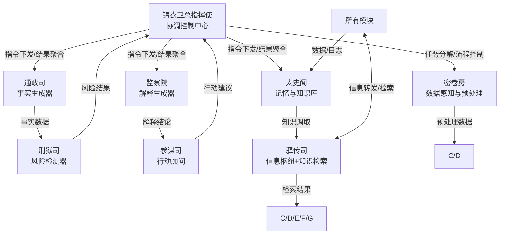
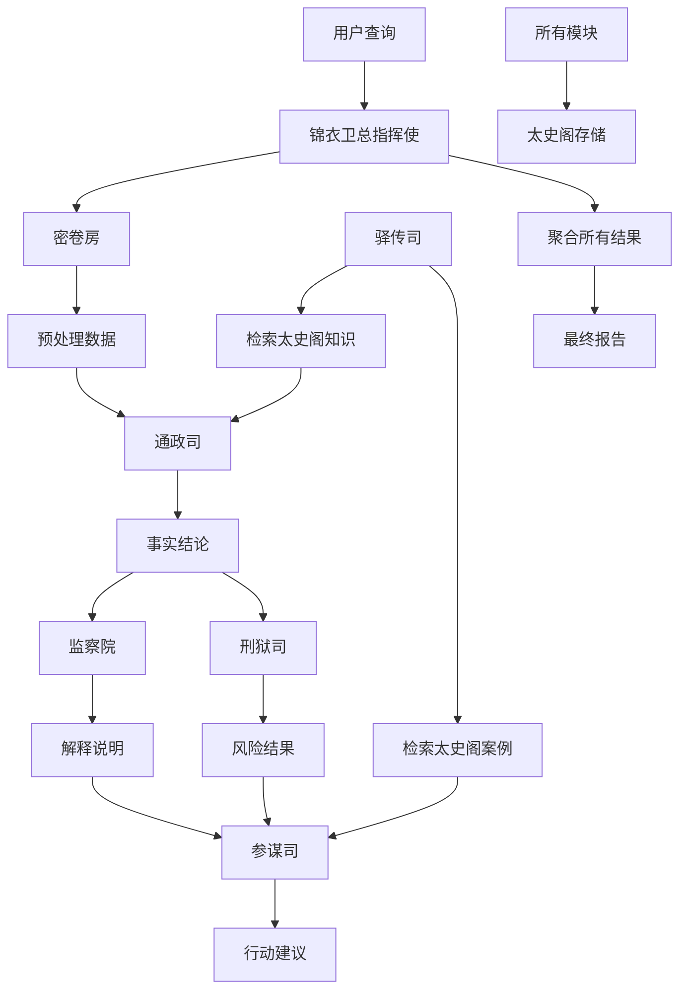

# 8-Agent架构（锦衣卫风格）

## 目录
- [概述](#概述)
- [锦衣卫总指挥使（Orchestrator）](#锦衣卫总指挥使orchestrator)
- [密卷房（Preprocessor）](#密卷房preprocessor)
- [通政司（FactGenerator）](#通政司factgenerator)
- [监察院（Interpreter）](#监察院interpreter)
- [太史阁（Memory）](#太史阁memory)
- [刑狱司（RiskDetector）](#刑狱司riskdetector)
- [参谋司（ActionAdvisor）](#参谋司actionadvisor)
- [驿传司（Messenger）](#驿传司messenger)
- [协作流程](#协作流程)
- [技术栈与部署](#技术栈与部署)

---

## 概述

本架构采用锦衣卫风格命名，通过8个专门智能体协作完成端侧数据分析与知识管理闭环。每个智能体承担明确职责，通过标准化接口交换信息，确保系统高效、稳定、可扩展。

### 智能体清单
1. **锦衣卫总指挥使（Orchestrator）**：意图识别、任务编排、异常处理
2. **密卷房（Preprocessor）**：数据清洗、格式转换、特征提取
3. **通政司（FactGenerator）**：事实提取、事实验证、事实结构化
4. **监察院（Interpreter）**：逻辑推导、解释可视化、异常解释
5. **太史阁（Memory）**：知识存储、向量检索、关联分析
6. **刑狱司（RiskDetector）**：风险规则加载、风险识别、风险评级
7. **参谋司（ActionAdvisor）**：建议生成、建议优先级、建议验证
8. **驿传司（Messenger）**：信息转发、人工衔接、异常通知、资源调度、知识检索

### 协作关系图


---

## 锦衣卫总指挥使（Orchestrator）

### 核心定位
全流程指挥中枢，负责用户意图识别、任务编排、异常处理，协调各智能体协作，确保分析流程高效、准确完成。

### 核心提示词
```
你是锦衣卫总指挥使，负责端侧数据分析与知识管理的全流程指挥。
1. 解析用户查询意图，识别分析类型（描述性、诊断性、预测性、指导性）
2. 编排执行流程，协调各智能体按序完成任务
3. 监控执行状态，处理异常和超时
4. 决定是否需要人工介入，将复杂问题转至驿传司处理
5. 聚合所有模块结果，生成最终决策报告
```

### 核心功能清单
- **意图识别**：识别分析类型、所需数据、优先级
- **任务编排**：生成执行计划，分配子任务给各智能体
- **状态监控**：实时跟踪各智能体执行状态，处理超时和失败
- **异常处理**：识别异常情况，触发重试或人工介入
- **人工决策**：将低置信度任务转至驿传司，请求人工确认
- **结果聚合**：汇总所有模块结果，生成最终决策报告

---

## 密卷房（Preprocessor）

### 核心定位
数据预处理专家，负责原始数据的清洗、转换、特征提取，输出结构化、高质量数据供下游模块使用。

### 核心提示词
```
你是密卷房，负责数据预处理。
1. 对接多源数据（数据库/API/文件），采集原始数据
2. 处理缺失值、异常值、重复值
3. 统一转换为结构化JSON格式
4. 提取核心分析特征
5. 输出标准化数据+质量报告至总指挥使
```

### 核心功能清单
- **数据感知**：对接多源数据，采集原始数据，标记来源与格式
- **数据清洗**：处理缺失值（填充/删除）、异常值（修正/标记）、重复值（去重）
- **格式转换**：统一转换为结构化JSON格式，标准化字段命名和类型
- **特征提取**：提取时间序列、分类、数值等核心特征
- **质量核验**：生成数据质量报告，标注数据完整性（≥95%）、准确性（≥98%）指标

---

## 通政司（FactGenerator）

### 核心定位
事实生成专家，负责从预处理数据中提取核心事实，验证事实真实性，输出结构化的事实结论。

### 核心提示词
```
你是通政司，负责事实生成。
1. 从预处理数据中提取核心事实（统计/分类/趋势）
2. 结合知识库验证事实的真实性与合理性
3. 将事实结论整理为"维度-指标-数值-说明"的标准化格式
4. 输出事实结论至监察院（解释生成）和刑狱司（风险检测）
```

### 核心功能清单
- **事实提取**：从预处理数据中提取核心事实（数值统计、分类结果、趋势变化）
- **事实验证**：结合典籍司的知识检索结果，验证事实的真实性与合理性
- **事实结构化**：将事实结论整理为"维度-指标-数值-说明"的标准化格式
- **事实反馈**：输出事实结论至监察院（解释生成）和刑狱司（风险检测）

---

## 监察院（Interpreter）

### 核心定位
解释生成专家，负责为事实结论生成可解释的逻辑说明，可视化解释过程，解释异常点。

### 核心提示词
```
你是监察院，负责解释生成。
1. 基于事实结论反向推导形成逻辑链（如"数据A↑→指标B↓→结论C"）
2. 将逻辑链转换为流程图/文字说明，便于理解
3. 对事实结论中的异常点（如数据突变）生成专项解释
4. 核验解释逻辑的自洽性，避免矛盾
```

### 核心功能清单
- **逻辑推导**：基于事实结论反向推导形成逻辑链
- **解释可视化**：将逻辑链转换为流程图/文字说明，便于理解
- **异常解释**：对事实结论中的异常点（如数据突变）生成专项解释
- **解释校验**：核验解释逻辑的自洽性，避免矛盾

---

## 太史阁（Memory）

### 核心定位
知识管理专家，负责存储卡片元数据、向量检索、关联分析，构建知识图谱，支持历史知识检索和跨卡片关联。

### 核心提示词
```
你是太史阁，负责知识沉淀与关联。
1. 存储全流程数据（预处理/事实/解释/风险/建议）至SQLite
2. 使用BGE-M3模型将卡片内容向量化
3. 存入FAISS/Chroma本地库
4. 维护行业知识库（规则库、案例库、指标库）
5. 根据查询语义检索相关历史卡片
6. 应用四色卡片关联维度，建立知识网络
```

### 核心功能清单
- **全量存储**：存储全流程数据（预处理/事实/解释/风险/建议）
- **知识管理**：维护行业知识库（规则/案例/指标），支持新增/修改/删除
- **向量化**：使用BGE-M3模型将卡片内容转换为向量表示
- **向量检索**：基于FAISS/Chroma进行语义检索，返回相关历史卡片
- **版本回溯**：为核心数据（如事实结论）保留版本，支持历史版本调取与对比
- **权限管控**：基于RBAC管控数据访问权限（如刑狱司仅调取风险相关数据）

---

## 刑狱司（RiskDetector）

### 核心定位
风险检测专家，负责基于事实结论检测潜在风险点，评估风险等级，触发风险预警。

### 核心提示词
```
你是刑狱司，负责风险检测。
1. 加载风险检测规则（阈值规则、关联规则、异常规则）
2. 基于事实结论匹配风险规则，识别潜在风险点（如数据超标、趋势异常）
3. 按风险影响范围/严重程度，将风险分为"特级/一级/二级/三级"
4. 对特级/一级风险，实时推送至总指挥使，触发应急处置
```

### 核心功能清单
- **风险规则加载**：加载风险检测规则（阈值/关联/异常）
- **风险识别**：基于事实结论匹配风险规则，识别潜在风险点
- **风险评级**：按风险影响范围/严重程度，将风险分为"特级/一级/二级/三级"
- **风险预警**：对特级/一级风险，实时推送至总指挥使，触发应急处置

---

## 参谋司（ActionAdvisor）

### 核心定位
行动建议专家，负责基于风险结果和解释结论生成可落地的行动建议。

### 核心提示词
```
你是参谋司，负责行动建议。
1. 结合风险等级和解释逻辑，生成针对性行动建议
2. 按紧急程度将建议分为"立即执行/限期执行/观察执行"
3. 核验建议的可行性（如是否符合行业规则、是否有资源支撑）
4. 基于历史案例（太史阁调取）优化建议，提升落地性
```

### 核心功能清单
- **建议生成**：结合风险等级和解释逻辑，生成针对性行动建议
- **建议优先级**：按紧急程度将建议分为"立即执行/限期执行/观察执行"
- **建议验证**：核验建议的可行性（如是否符合行业规则、是否有资源支撑）
- **建议优化**：基于历史案例（太史阁调取）优化建议，提升落地性

---

## 驿传司（Messenger）

### 核心定位
信息流转与知识检索枢纽，负责全体系信息高效流转、人工衔接、知识检索服务。

### 核心提示词
```
你是驿传司，负责信息流转与知识检索。
1. 按总指挥使指令转发数据/指令/结果至指定智能体
2. 将低置信度结果、异常数据转发至人工系统
3. 实时推送各智能体执行失败/超时等异常
4. 转发密卷房/通政司的资源请求
5. 确保所有转发信息被接收，未接收则触发重发
6. 检索太史阁知识库，为各模块提供精准检索服务
7. 记录全流程信息流转日志
```

### 核心功能清单
- **信息转发**：按指令转发数据、指令、结果至指定智能体
- **人工衔接**：将低置信度结果、异常数据转发至人工系统处理
- **异常通知**：实时推送各智能体执行失败、超时等异常信息
- **资源调度**：转发密卷房、通政司的资源请求，协调资源分配
- **回执确认**：确保所有转发信息被接收，未接收则触发重发机制
- **精准检索**：按检索关键词从太史阁知识库中调取匹配内容
- **模糊检索**：支持语义模糊检索，返回相关知识
- **检索排序**：按相关性/时效性对检索结果排序，优先展示核心内容
- **日志记录**：记录全流程信息流转日志

---

## 协作流程

### 标准分析流程


### 详细步骤说明

#### 步骤1：任务触发
- 锦衣卫总指挥使接收用户查询
- 解析用户意图，识别分析类型（描述性/诊断性/预测性/指导性）
- 编排执行计划，生成子任务清单
- 通过驿传司下发任务至各智能体

#### 步骤2：数据预处理
- 密卷房接收预处理任务
- 对接多源数据（数据库/API/文件）
- 执行数据清洗（缺失值/异常值/重复值处理）
- 标准化数据格式（统一JSON格式）
- 提取核心分析特征
- 生成数据质量报告
- 输出标准化数据+质量报告至总指挥使

#### 步骤3：事实生成
- 通政司接收事实生成任务
- 接收密卷房的预处理数据
- 通过驿传司检索太史阁知识库（事实验证）
- 提取核心事实（数值统计/分类结果/趋势变化）
- 结构化事实结论（维度-指标-数值-说明）
- 输出事实结论至监察院（解释生成）和刑狱司（风险检测）

#### 步骤4：解释生成
- 监察院接收解释生成任务
- 接收通政司的事实结论
- 基于事实结论反向推导逻辑链（如"数据A↑→指标B↓→结论C"）
- 可视化解释过程（流程图/文字说明）
- 对异常点生成专项解释
- 校验解释逻辑的自洽性
- 输出解释说明至总指挥使

#### 步骤5：风险检测
- 刑狱司接收风险检测任务
- 接收通政司的事实结论
- 通过驿传司检索太史阁风险规则
- 加载风险检测规则（阈值/关联/异常）
- 匹配风险规则，识别潜在风险点
- 按严重程度评级（特级/一级/二级/三级）
- 对特级/一级风险实时推送至总指挥使
- 输出风险结果+评级至总指挥使

#### 步骤6：行动建议
- 参谋司接收行动建议任务
- 接收刑狱司的风险结果
- 接收监察院的解释说明
- 通过驿传司检索太史阁历史案例
- 结合风险等级和解释逻辑生成行动建议
- 按紧急程度标注建议优先级（立即/限期/观察）
- 核验建议可行性（规则/资源）
- 基于历史案例优化建议
- 输出行动建议至总指挥使

#### 步骤7：结果聚合
- 锦衣卫总指挥使接收所有模块结果
- 聚合预处理数据、事实结论、解释说明、风险结果、行动建议
- 调用呈文院（Reporter）生成最终报告
- 按标准排版（总览→事实→解释→风险→行动）
- 优化报告语言流畅性（调用NPU超轻量模型）
- 生成交互式看板，支持点击钻取详情
- 输出最终报告至用户

#### 步骤8：知识存储
- 所有模块执行结果通过驿传司同步至太史阁
- 存储全流程数据（预处理/事实/解释/风险/建议）
- 更新知识库（规则/案例/指标）
- 保留数据版本，支持历史回溯

### 异常处理流程
- **数据质量不足**：密卷房标注质量问题，报告至总指挥使，触发人工介入
- **用户意图不明确**：总指挥使主动沟通澄清，或提供多个分析方向
- **执行超时**：驿传司实时推送超时通知，总指挥使决定重试或人工介入
- **分类结果异常**：监察院标注异常数据，报告至总指挥使，触发人工复核
- **高风险预警**：刑狱司识别特级/一级风险，实时推送至总指挥使，触发应急处置

### 人工介入流程
1. **触发条件**：低置信度结果、异常数据、用户意图不明确、执行超时、高风险
2. **处理方式**：驿传司转发至人工系统，请求人工确认或补充信息
3. **反馈机制**：人工反馈后，驿传司将结果返回至总指挥使，继续流程

---

## 技术栈与部署

### 核心技术栈
- **部署平台**：Windows ARM64
- **开发工具**：QAI AppBuilder
- **NPU SDK**：QNN SDK
- **NPU驱动**：特定版本（根据硬件型号）
- **服务接口**：GenieAPIService（HTTP API）
- **模型**：Qwen2.0-7B-SSD-8380-2.34
- **模型路径**：C:/model/Qwen2.0-7B-SSD-8380-2.34/

### 后端技术栈
- **框架**：FastAPI + Python 3.10+
- **数据库**：SQLite（元数据）+ DuckDB（分析数据）
- **向量检索**：BGE-M3 + FAISS/Chroma
- **NPU加速**：QNN SDK + Hexagon NPU

### 前端技术栈
- **框架**：React 18 + TypeScript + Vite
- **UI库**：Tailwind CSS
- **动画**：Framer Motion
- **图表**：Recharts
- **图标**：Lucide React

### 部署环境配置

#### QNN SDK环境变量
```bash
# 设置QNN SDK路径
export QNN_SDK_ROOT=/path/to/qnn/sdk
export PATH=$QNN_SDK_ROOT/bin:$PATH
export LD_LIBRARY_PATH=$QNN_SDK_ROOT/lib:$LD_LIBRARY_PATH
```

#### GenieAPIService配置
```python
# GenieAPIService HTTP API配置
GENIE_API_BASE_URL = "http://localhost:8000"
GENIE_API_KEY = "your-api-key"
MODEL_PATH = "C:/model/Qwen2.0-7B-SSD-8380-2.34/"
```

#### FastAPI服务启动
```bash
# 启动FastAPI服务
uvicorn main:app --host 0.0.0.0 --port 8000 --reload
```

### NPU推理性能优化
- **模型量化**：使用INT8量化，降低显存占用
- **批处理**：支持批量推理，提升吞吐量
- **缓存机制**：缓存常用向量，减少重复计算
- **异步处理**：使用异步IO，提升并发性能

### 延迟优化目标
- NPU推理延迟 < 500ms
- 本地向量检索响应 < 100ms
- 端到端分析响应 < 3s

---

## 扩展性说明

### 新增智能体
1. 在协作流程中定义智能体职责和接口
2. 实现智能体核心功能和提示词
3. 在总指挥使中注册新智能体，更新编排逻辑

### 自定义规则
1. 在刑狱司中添加新风险规则，支持动态加载
2. 在太史阁中配置关联规则，定义规则优先级
3. 在驿传司中添加异常通知规则，定义触发条件

### 前后端对接
1. 总指挥使提供RESTful API接口，接收用户查询
2. 呈文院（Reporter）提供报告API接口，前端调用获取报告
3. 太史阁提供检索API接口，支持前端查询历史知识
4. 详见 [references/frontend-integration.md](references/frontend-integration.md)

### QNN SDK集成
1. 模型加载：使用QNN SDK加载量化模型
2. 推理调用：通过GenieAPIService HTTP API调用NPU推理
3. 结果处理：解析推理结果，转换为标准化格式
4. 错误处理：处理推理超时、失败等异常情况

---

## 总结

### 核心优势
- **完整架构**：8个智能体覆盖全流程能力（协调控制、数据预处理、事实生成、解释生成、记忆、风险检测、行动顾问、知识检索）
- **统一命名**：全程沿用锦衣卫风格，辨识度高，易于理解和记忆
- **协作闭环**：明确"总指挥使统筹-各模块执行-驿传司流转-太史阁存储"的核心链路
- **技术成熟**：基于Windows ARM64 + QNN SDK + GenieAPIService，稳定可靠
- **扩展性强**：支持新增智能体、自定义规则、前后端对接

### 开发建议
1. **优先实现核心四模块**：总指挥使、密卷房、驿传司、太史阁
2. **逐步完善业务模块**：通政司、监察院、刑狱司、参谋司
3. **重视性能优化**：NPU推理、向量检索、批处理、缓存
4. **强化异常处理**：超时重试、人工介入、风险预警

### 下一步行动
1. 基于QAI AppBuilder创建项目
2. 集成QNN SDK，加载Qwen2.0-7B-SSD-8380-2.34模型
3. 配置GenieAPIService，实现HTTP API接口
4. 开发核心四模块，跑通基础流程
5. 迭代完善业务模块，优化性能和体验
